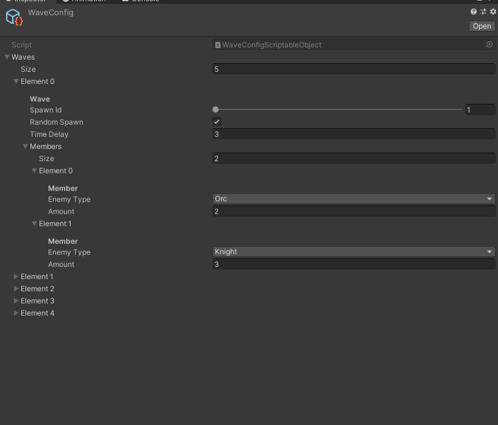
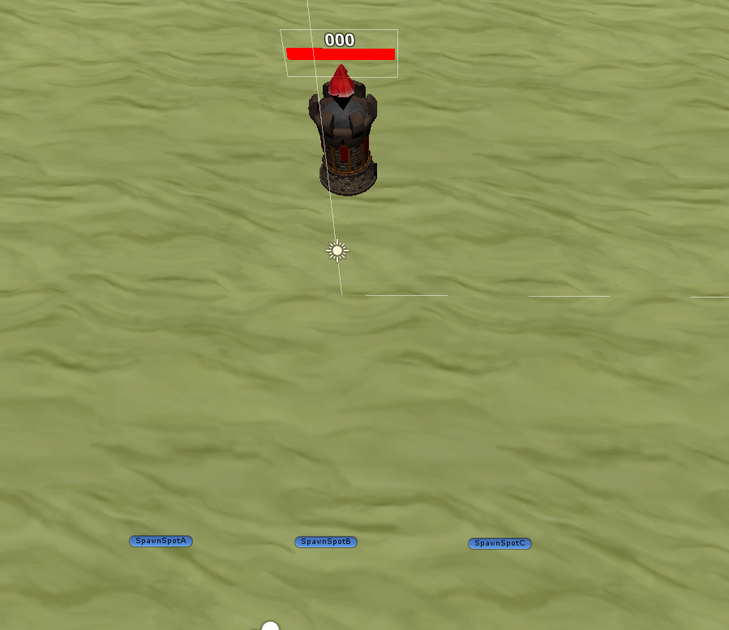

# Tower Defense Game
---------------------
A Tower Defense Game made with Unity 
---------------------

# How to play: 

Select card with construction view you are, click at the field to build it.
Defend your castle of the wave enemies.

# Control: 

- Mouse Left Click : Select card and put on field;
- Mouse Right Click : Cancel the construction is selected.

# Waves

Waves and members creation with Scriptable Object

# Spawn Waves

Spawn waves base on prefab spots

